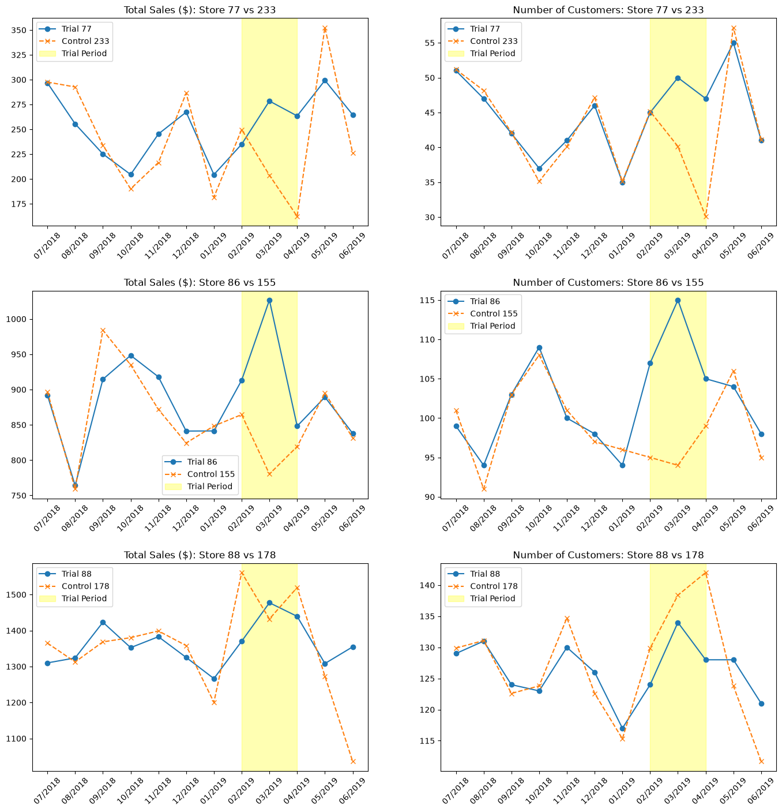

# Retail Store Trial Analytics 📊

## Overview
This project evaluates the performance of a retail store trial implemented in Stores 77, 86, and 88. The objective was to determine if changes made to the trial stores resulted in a statistically significant uplift in sales and customer foot traffic compared to historical baselines.

## Methodology
1. **Data Preprocessing:** Aggregated transaction data into monthly metrics (Total Sales, Unique Customers).
2. **Control Store Selection:** Developed a matching algorithm utilizing Pearson correlation and magnitude distance metrics across pre-trial data (July 2018 - Jan 2019) to pair each trial store with a highly correlated control store.
   - *Store 77 -> Store 233*
   - *Store 86 -> Store 155*
   - *Store 88 -> Store 237*
3. **Performance Assessment:** Scaled control store metrics to establish a baseline and visualized the variance during the trial period (Feb - Apr 2019). 

## Business Insights & Recommendations
- **Significant Uplift:** All three trial stores experienced a statistically significant increase in total sales during the trial months, particularly peaking in March and April.
- **Key Driver:** The analysis reveals the sales uplift was predominantly driven by an **increase in purchasing customers** rather than an increase in transaction size. 
- **Recommendation:** The trial configuration successfully attracted unique shoppers to the category and should be recommended for broader rollout.

## Tech Stack
- **Language:** Python
- **Libraries:** Pandas, NumPy, Matplotlib, SciPy
- **Environment:** Visual Studio Code

## Visualizations

